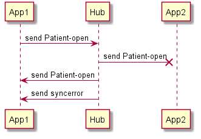
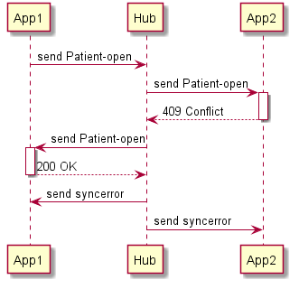
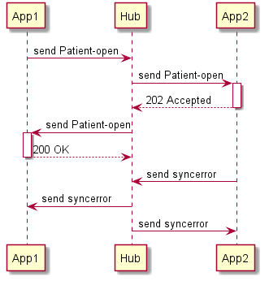

# Sync errors and recovering from them

This section relates to the topic of sync-errors and recovering from the out of sync scenario. A system can get out of sync if one or more of the subscribed clients cannot be reached or actively refuses to follow a context change event.

## Sources of sync error

Sync errors occur in the situations, each of them is described in the sections below.

### Connection is lost

#### Application is no longer connected to the hub

The application detects that it is no longer connected to the hub. In the case of a `webhook` connection, this detected by the fact that it does no longer receive `heartbeat` events. For `websocket` this can be detected by the websocket connection is lost. It is RECOMMENDED that it also subscribes for `heartbeat` events.

#### Hub is no longer connected to a application

#### Event cannot be delivered

When the hub cannot send and event to subscribed client because the client cannot be reached, it SHALL send a `syncerror` event for each failed delivery. Note a subscription will end when the subscription expires.

The hub SHOULD use the information provided in the `subscriber.name` field to provide information on what application caused the `syncerror`.

### Application refuses to follow

#### Application refuses event

A subscriber refuses an event, by sending an error code when the event is send. In the case an event is refused, it may respond with a 500 to indicate a client issue, or a 409 to indicate the client is in conflict and refuses the event.

When a hub detects an event has been refused, it SHALL send a `syncerror` event. The hub SHOULD use the information provided in the `subscriber.name` field to provide information on what application caused the `syncerror`.

#### Application refuses event after accepting

An subscriber refuses an event, by sending an error code when the event is send.
When the subscriber wants to evaluate the decision to accept the event, it will respond with a 202 Accepted.  

In the case an event is refused, it SHALL send a `syncerror` event. The subscriber SHOULD send such event within 5 seconds after receiving the event.

## Recovery from sync-errors

Once a syncerror has been received, the application should assume that the applications are no longer in sync.

## Open topics

* Do I get all sync-errors or only those related to events I subscribed to?
* Does a hub send an `syncerror` for each client that cannot be reached or refused or is it allowed to combine them in one.

